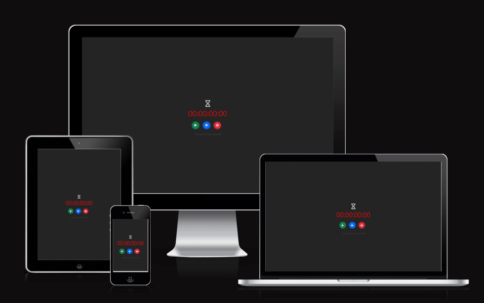
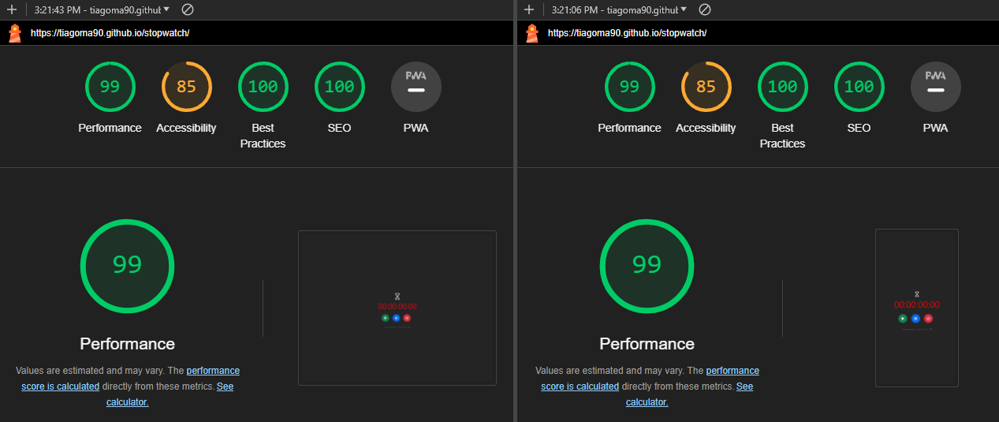

# stopwatch
The 'Stopwatch' application is an interactive page for people who want to make use of digital timer.
Visitors of this app will be able to Start, Pause and Stop/Reset the timer.

## Live project
The Live app can be found [here](https://tiagoma90.github.io/stopwatch/).

## Purpose of the website.
- To allow users to use the timer on their free time, such as sports.
- To allow users to Play, Pause and Reset the timer anytime they whish.

## Target Audience
- People who want to take advantage of the timer on their free will.
- People who are primarly in search of timer for their sports or leisure experiences.

## Features
The website was developed with the intent to offer interactive features:
- Buttons and its responsiveness when pressed/on clicked, during its incrementation.
- Sounds and its responsiveness when pressed. (Feature removed during development)

# Process
## Skeleton
- The website took a "Mobile-First" approach, as it is primarly targeted for people using mobile devices.
- The structure of the page can be more or less defined and follows the skeleton for the overall website as seen below:

## Styling
- The color palette chosen for this website, makes use of a dark background, followed by a vibratnt red text for the timer.
- The buttons have been colored accordingly for the Play, Pause, reset buttons (Green, Blue, Red), with a boreder around it. When hovered the buttons display a stand out effect.
- The icon above the timer, of a hourgalss was animated according to the actions of a user. When "Play" is pressed, it rotates clockwise. When "Pause" is hit, the hourglass rests sideways. When "Stop" is pushed, the hourglass is marked as empty from the start. 

# Testing
Testing has been performed for its Performance, Accessibility, Best Practices and SEO.
- With overall reviews for desktops & mobiles on 99%, under Chromes icognito mode.

## Development & Deployment
The project was developed using GitHub and GitPod platforms.

- Navigate to: "Repositories" and create "New".
- Mark the following fields: ✓ Public ✓ Add a README file.
- Select a new template.
- Add a Repository name: "stopwatch".
- And create Repository.

This project was developed using GitPod and suffered various executions using the inbuild Terminal.
- git add . - Command used before commiting.
- git commit -m "written imperative declaration" - Command used to declare changes and updates.
- git push - Command used to push all updates to the GitHub Repository and live version.
- python -m http.server 8000 - Command used to load the website on port 8000.

The website was deployed via Github
- Under the given Repository, navigate to "Settings".
- Navigate to "Pages" from the left-hand bar.
- From here the "Source" should be set to "Deploy from branch".
- On "Branch" select "main" and save.
- The website was deployed via Github and the live website can be found [here](https://tiagoma90.github.io/stopwatch/).

# Technologies
## Languages
The website was written under HTML5, CSS3, Bootstrap, & JS(ES6).

- HTML5 - Structure of the page
- CSS3 - Style of the page
- JSES6 - Logic and interactivity of the page
- Bootstrap

Other forms of development as follows:
- FontAwesome - Source of icons
- Github - Host for the repository
- Gitpod - Code editor
- Chrome DevTools - Testing tool
- WAVE Evaluation tool - Testing tool
- Bytes.dev - Testing screen sizes

## Fonts & icons:
- The Fonts displayed in this website were imported from [Google Fonts](https://fonts.googleapis.com/css2?family=Rubik+Lines&display=swap), but later commented out for its simplicity and readability.
-The ions were imported from Fontaweseome.
